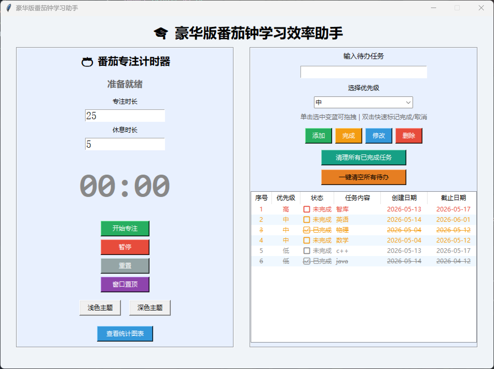

#  番茄钟学习助手

基于 Python Tkinter 开发的桌面级番茄钟工具，集成专注计时、任务管理与学习数据统计三大功能，帮你高效管理学习时间，追踪任务进度。

---

##  项目预览


---

##  核心功能
### 1. 番茄钟专注计时
- 自定义专注/休息时长（1-120分钟）
- 专注结束自动提醒，支持循环计时
- 窗口置顶功能，防止被其他应用打断
- 浅色/深色双主题切换，适配不同场景

### 2. 待办任务管理
- 任务添加、修改、删除与拖拽排序
- 高/中/低三级优先级标记，颜色区分
- 截止日期自动校验，超时任务自动变浅
- 双击任务快速标记完成，已完成任务添加文字划线

### 3. 学习数据统计
- 实时展示今日专注时长、本周总时长与番茄完成数
- 近7天学习时长柱状图可视化
- 数据自动本地保存，重启程序不丢失

---

##  技术栈
- 语言：Python 3.x
- 图形界面：Tkinter（无需额外安装依赖）
- 数据存储：JSON 文件本地持久化

---

##  使用方法
1.  克隆或下载项目代码到本地
2.  运行主程序：
    ```bash
    python pomodoro_app.py
